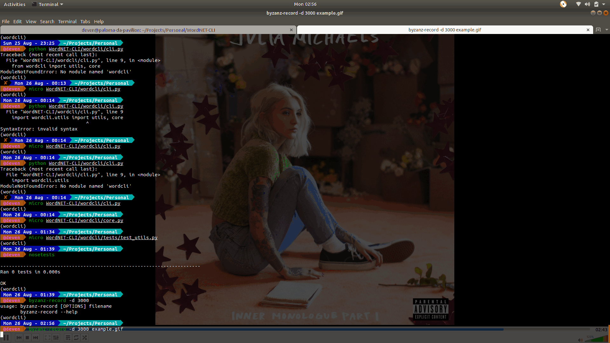

# WordCLI

<span> <a href="https://travis-ci.com/deven96/wordcli"></a> <a href="https://opensource.org/licenses/GNU"></a> <a href="https://badge.fury.io/py/wordcli"></a> </span>

Simple command line dictionary that harnesses the power of NLTK and WordNET

## Installation

r3con1z3r supports **Python 2** and **Python 3**.

```bash
   # install from setup
   python setup.py install
```

## Modules

wordcli has a pyttsx3 dependency, look up system installation properly for different platforms
For the extra coloring to work on windows, win_unicode_console and colorama have to be installed

**For Coloring on Windows:** `pip install win_unicode_console colorama`

## Demo

Simple usage of wordCLI to perform dictionary lookup



## Tests

Simply run the tests by installing `nose`

```bash
	# clone repository
	git clone

	# install nosetest suite
	pip install nose

	cd wordcli
	
	nosetests
```

## License

wordcli is licensed under the GNU GPL license. take a look at the [LICENSE](/LICENSE) for more information.

## Contribution

This project is open to contributions, Bug reports and pull requests are welcome on GitHub at https://github.com/deven96/wordcli. Current contributors can be viewed by running `r3con1z3r -a`
